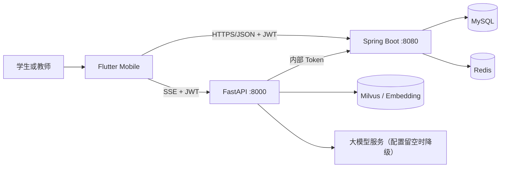
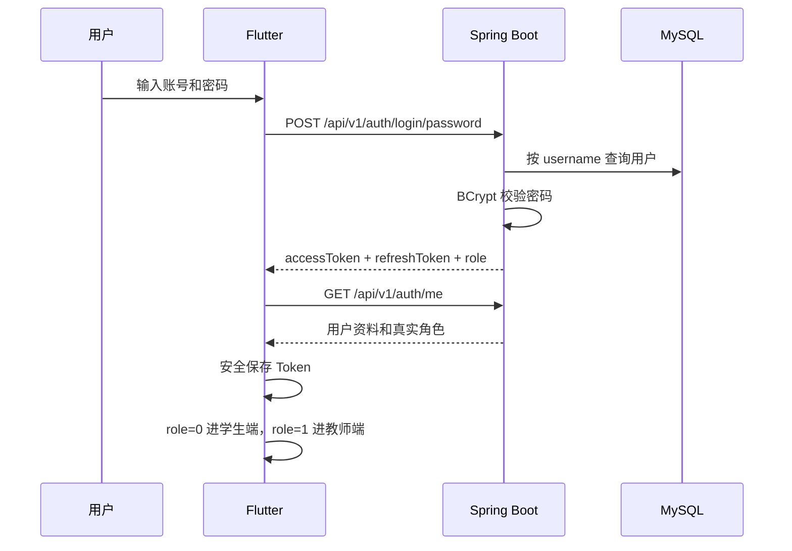
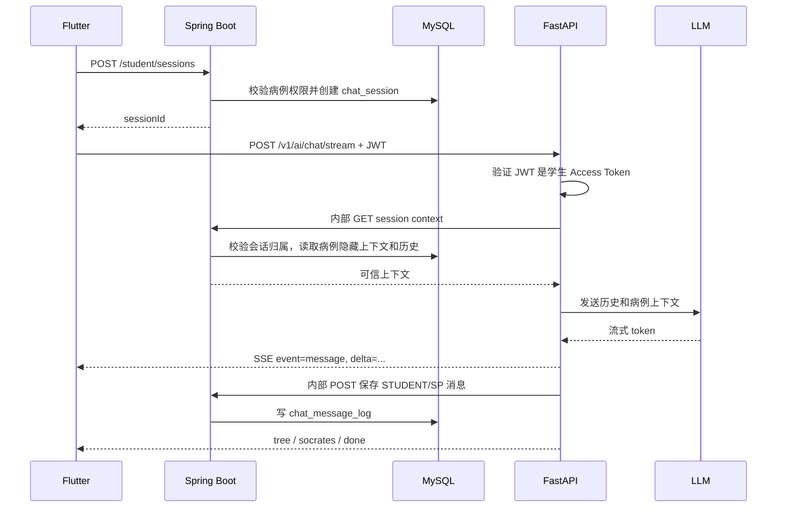

# 智愈寻真 Flutter Mobile 全链路开发与部署说明

> 文档版本：2026-07-20  
> 本次范围：Flutter Mobile + Spring Boot + FastAPI + MySQL + Redis  
> 明确不在本次范围：Vue Web 页面改造  
> 适合读者：第一次接触 Docker、数据库、前后端联调的开发者

---

## 1. 先说结论：这次到底做到了什么

本次改造把 Flutter Mobile 的主要页面从“打开页面就读取固定 MockData”改成了“登录后携带 JWT 请求 Spring Boot，涉及 AI 的问诊再由 Flutter 连接 FastAPI SSE，FastAPI 通过内部接口读取和回写 Spring Boot”。

现在已经接通的主链路包括：

1. 手机号验证码注册，注册时选择学生或教师身份。
2. 账号密码登录。
3. 手机号 + 短信验证码登录。
4. 登录后根据后端返回的真实角色进入学生端或教师端，客户端不能临时切换身份；管理角色由 Flutter 拒绝并引导使用 Web 管理端。
5. 教师注册必须提交资质编号和科室，经管理员审核通过后才能登录教师端。
6. Access Token、Refresh Token 安全存储和自动刷新。
7. 学生病例列表、病例详情、每日一例、答题结果保存。
8. 学生问诊会话创建、SSE 流式回答、消息持久化、结束会话。
9. 学生错题本、学习活动、能力概览。
10. 教师病例创建、病例列表、病例广场引用。
11. 教师授权班级查询、作业创建、作业列表和进度数据。
12. 学生作业列表、带作业实例进入问诊、提交大病历、格式盾牌检查、触发 AI 批阅。
13. 教师批阅队列、查看最新 AI 批阅、人工确认覆盖。
14. Flyway 增量建表、完整初始化 SQL、可选演示数据 SQL。
15. 未配置大模型时的“明确降级”，不会把降级结果伪装成真实模型结果。

本次没有修改 `front/` 中的 Vue Web。Docker Compose 仍保留 `front` 服务，因为它原本就属于项目，但本次所有业务改造只面向 Flutter Mobile。

---

## 2. 系统结构，用最容易理解的话解释

可以把系统理解成四个工作人员：

- Flutter：负责把页面展示给用户、收集用户输入。
- Spring Boot：负责账号、权限、病例、作业、消息和数据库，是业务数据的唯一可信入口。
- FastAPI：负责调用大模型、流式生成模拟病人回答、AI 批阅和 RAG。
- MySQL/Redis：MySQL 保存长期数据；Redis 保存短期短信验证码等临时数据。



最重要的安全原则是：

- Flutter 只拿到学生应该看到的病例资料。
- 隐藏疾病、标准问诊路径等答案只保存在后端，并通过内部接口给 FastAPI。
- Flutter 即使篡改请求，也不能读取隐藏答案。
- FastAPI 的内部回调使用 `X-Internal-Token`，普通 App 用户不能调用。
- Flutter 调 FastAPI 的问诊接口必须携带 Spring Boot 签发的学生 JWT。

---

## 3. 第一次启动：请完全照着做

### 3.1 先备份，不要跳过

如果当前 MySQL 已经有重要数据，请先备份：

```powershell
docker exec zhiyu-mysql mysqldump -uroot -p你的密码 --databases zhiyu_db > zhiyu_db_backup.sql
```

如果 PowerShell 对重定向编码有影响，也可以使用数据库管理工具导出。

本次开发过程没有对你正在运行的 `zhiyu_db` 执行迁移或导入演示数据；只在临时 MySQL 中验证了迁移脚本。

### 3.2 准备环境变量

项目根目录已有 `.env.example`。第一次使用时：

```powershell
Copy-Item .env.example .env
```

开发环境至少检查：

```dotenv
MYSQL_ROOT_PASSWORD=root123456
MYSQL_DATABASE=zhiyu_db
JWT_SECRET=请改成至少32字节的随机字符串
AI_INTERNAL_TOKEN=请改成一段随机字符串
SMS_PROVIDER=
LLM_BASE_URL=
LLM_API_KEY=
```

注意：

- `JWT_SECRET` 必须同时给 Spring Boot 和 FastAPI，Compose 已经这样传递。
- `AI_INTERNAL_TOKEN` 必须同时给 Spring Boot 和 FastAPI。
- 开发环境 `SMS_PROVIDER` 可以留空。
- 大模型相关配置可以留空，系统会明确显示“降级结果”。
- 生产环境不能使用示例密钥。

### 3.3 两种数据库初始化方式

#### 情况 A：完全新的 Docker 数据卷

MySQL 容器第一次创建空数据卷时，会自动执行：

```text
deploy/mysql/init.sql
```

这个文件创建完整数据库结构。

请注意：`docker-entrypoint-initdb.d` 只会在 MySQL 数据目录为空时执行。容器已经运行过以后，即使你修改 `init.sql`，MySQL 也不会自动重新执行它。

#### 情况 B：已有数据库，推荐用 Flyway

Spring Boot 启动时会扫描：

```text
backend/src/main/resources/db/migration/
```

本次增加：

```text
V1__mobile_fullstack_schema.sql
```

它会：

- 给手机号添加唯一索引。
- 给每日一例补充题目、选项、标准答案、解析、教材来源字段。
- 给作业实例补充 AI 批阅状态字段。
- 创建班级、教师班级授权、作业目标班级、每日答题记录表。

`baseline-on-migrate: true` 允许已有老库建立 Flyway 基线，再执行新迁移。

### 3.4 可选：导入演示数据

演示数据脚本：

```text
deploy/mysql/seed/demo_data.sql
```

导入方式：

```powershell
Get-Content deploy/mysql/seed/demo_data.sql -Raw | docker exec -i zhiyu-mysql mysql -uroot -p你的密码
```

它会以幂等方式创建：

- 一个演示班级。
- 一个教师账号 `teacher01`。
- 一个学生账号 `student01`。
- 教师对演示班级的授权。
- 一个公开病例。
- 今天的每日一例。
- 一个演示作业和学生作业实例。

演示账号密码统一是：

```text
123456
```

演示 SQL 不会删除已有数据；它通过用户名和业务标题判断是否已经存在。

### 3.5 启动 Docker

```powershell
docker compose up -d --build
```

查看状态：

```powershell
docker compose ps
```

查看日志：

```powershell
docker compose logs -f backend
docker compose logs -f ai
```

检查服务：

```text
Spring Boot: http://localhost:8080/api/v1/health
Swagger:     http://localhost:8080/swagger-ui.html
FastAPI:     http://localhost:8000/health
FastAPI Docs:http://localhost:8000/docs
```

### 3.6 运行 Flutter

Android 模拟器：

```powershell
cd mobile
flutter pub get
flutter run --dart-define=API_BASE_URL=http://10.0.2.2:8080 --dart-define=AI_BASE_URL=http://10.0.2.2:8000
```

Android 真机不能使用 `10.0.2.2`，要改成电脑局域网 IP，例如：

```powershell
flutter run --dart-define=API_BASE_URL=http://192.168.1.20:8080 --dart-define=AI_BASE_URL=http://192.168.1.20:8000
```

请确保：

- 手机和电脑在同一局域网。
- Windows 防火墙允许 8080 和 8000 端口。
- Docker override 文件确实把两个端口映射到宿主机。

离线 UI 演示才使用：

```powershell
flutter run --dart-define=USE_MOCK=true
```

真实联调默认是 `USE_MOCK=false`。

---

## 4. 登录是怎么工作的

### 4.1 手机号验证注册

Flutter 调用：

```http
POST /api/v1/auth/register
```

学生请求示例：

```json
{
  "username": "student02",
  "password": "study2026",
  "realName": "李同学",
  "phone": "18500000003",
  "code": "123456",
  "role": 0
}
```

教师注册时 `role` 为 `1`，并且必须额外提供 `certificateNo` 和 `department`。服务端只接受学生和教师两种注册角色；手机号与账号均唯一；密码使用 BCrypt 保存。教师账号创建后的 `auditStatus=1`，管理员审核通过前登录会返回待审核状态。注册接口不返回 Token，成功后客户端回到登录页。

### 4.2 账号密码登录



客户端已经删除“先选学生/教师身份再登录”的做法。原因是身份必须来自数据库，不能相信用户在客户端点了哪个按钮。

角色约定：

| role | 身份 | Flutter Mobile 行为 |
|---:|---|---|
| 0 | 学生 | 进入学生工作台 |
| 1 | 教师 | 进入教师工作台 |
| 2 及以上 | 教秘、主任、管理员、运维 | 拒绝进入 App，提示使用 Web 管理端 |

### 4.3 手机验证码登录

请求验证码：

```http
POST /api/v1/auth/sms-code
Content-Type: application/json

{"phone":"18500000002"}
```

开发环境：

- 生成 6 位随机验证码。
- Redis 只保存 BCrypt 哈希，不保存明文。
- 有效期 5 分钟。
- 同一手机号 60 秒内不能重复发送。
- 每小时最多 5 次。
- 最多允许 5 次错误尝试。
- `dev/test` 会在响应中返回 `devCode`，并写脱敏日志，方便本地联调。

生产环境：

- 不返回 `devCode`。
- 当前没有绑定具体短信厂商。
- `SMS_PROVIDER` 配置后仍需要实现对应供应商适配器；未实现时会明确返回“短信服务未配置”。

验证码登录：

```http
POST /api/v1/auth/login/sms
Content-Type: application/json

{"phone":"18500000002","code":"123456"}
```

手机号登录仍只负责登录，不会隐式创建账号。新用户必须显式走注册接口并选择身份；教师身份还必须经过资质审核，避免短信登录绕过身份校验。

### 4.4 Token 刷新

Flutter 的 Dio 拦截器会给业务请求加：

```http
Authorization: Bearer <access-token>
```

Spring Boot 返回业务码 `1001/1002` 时，Flutter 会：

1. 只发起一次 Refresh 请求。
2. 其他同时失败的请求等待这次刷新。
3. 保存新 Token。
4. 自动重试原请求。

Token 使用 `flutter_secure_storage` 保存；用户昵称、角色等非敏感快照使用 SharedPreferences。

---

## 5. 问诊 SSE 全链路



Flutter 识别的 SSE 事件：

| 事件 | 用途 |
|---|---|
| `message` | 模拟病人回答增量，Flutter 逐段拼接 |
| `citation` | RAG 引用来源 |
| `status` | 例如大模型未配置、进入降级模式 |
| `tree` | 思维树更新 |
| `socrates` | 智能导师提示 |
| `safety` | 安全策略拦截 |
| `error` | 结构化错误 |
| `done` | 本轮流结束 |

会话权限不是“有 JWT 就行”，还会继续检查：

- 会话属于当前学生。
- 会话状态仍是进行中。
- 请求中的 caseId 与会话一致。
- 非作业病例必须是公开审核通过病例，或当天每日一例。
- 作业病例必须属于当前学生的作业实例。

学生选择“提交判断”完成本轮流以后，Flutter 调用 `/sessions/{id}/finish`，会话状态改为已完成。当前完成动作保存结束时间，但不会伪造 OSCE 评分；只有真实评分回写后，能力页才显示评分维度。

---

## 6. 数据库说明

### 6.1 本次新增或补强的核心表

| 表 | 作用 | 谁写入 |
|---|---|---|
| `sys_user` | 用户、手机号、角色、班级、教师资质与审核状态 | 注册接口/管理端/初始化脚本 |
| `teaching_class` | 教学班级基础信息 | 初始化/未来管理端 |
| `teacher_class_authorization` | 哪个教师能管理哪个班 | 管理端/演示脚本 |
| `sp_case_config` | 病例、患者画像、隐藏疾病、标准路径 | 教师端 |
| `case_audit_log` | 病例审核记录 | 管理端 |
| `assignment` | 作业主记录 | 教师端 |
| `assignment_target_class` | 作业下发到哪些班 | 教师端 |
| `assignment_instance` | 每个学生各自的一份作业实例 | 创建作业时批量生成 |
| `chat_session` | 一次问诊会话 | 学生开始问诊时 |
| `chat_message_log` | 问诊中的每条消息 | FastAPI 通过内部接口 |
| `medical_record_review` | AI/教师批阅版本 | AI 回调、教师复核 |
| `mistake_book` | 学生错题 | AI 内部回调 |
| `daily_case_schedule` | 每日一例排期、问题、答案和解析 | 管理端 |
| `daily_case_submission` | 每个学生每日一例的答案 | 学生端 |
| `system_config` | 系统配置 | 管理端 |
| `audit_log` | 关键操作审计 | 各业务服务 |

### 6.2 为什么既有 init.sql 又有 Flyway

- `init.sql` 给“从零创建的新库”使用。
- Flyway 给“已经存在的库”做增量升级。
- `seed/demo_data.sql` 只负责可选演示数据，不属于正式结构迁移。

不要把三个脚本混为一谈，也不要为了执行新 `init.sql` 直接删除生产数据卷。

### 6.3 手机号唯一索引

`sys_user.phone` 增加唯一索引 `uk_phone`。导入旧数据前要先确认没有重复手机号：

```sql
SELECT phone, COUNT(*)
FROM sys_user
WHERE phone IS NOT NULL AND phone <> ''
GROUP BY phone
HAVING COUNT(*) > 1;
```

如有结果，先人工清理，再执行迁移。

---

## 7. Flutter 端改了什么

### 7.1 网络与会话层

| 文件 | 修改内容 |
|---|---|
| `mobile/lib/core/config/app_config.dart` | 增加 API/AI 基址、真实模式默认值、测试隔离 |
| `mobile/lib/data/sources/api_client.dart` | Dio、JWT、统一错误、Token 刷新和重试 |
| `mobile/lib/data/sources/token_store.dart` | 使用安全存储保存 Token |
| `mobile/lib/data/sources/api_exception.dart` | 统一网络/业务/鉴权/契约错误 |
| `mobile/lib/data/repositories/auth_repository.dart` | 密码、短信、恢复会话、退出登录 |
| `mobile/lib/data/repositories/chat_repository.dart` | 创建会话、加载历史、SSE、结束会话 |
| `mobile/lib/data/repositories/content_repository.dart` | 病例、每日一例、作业、批阅、错题、能力数据 |

### 7.2 学生页面

| 页面 | 真实数据来源 |
|---|---|
| 登录页 | `/auth/login/password`、`/auth/sms-code`、`/auth/login/sms` |
| 首页 | 每日一例、病例广场、错题本 |
| 病例列表/详情 | 病例广场接口 |
| 每日答题 | 每日一例提交接口，结果写数据库 |
| 问诊室 | Spring Boot 建会话 + FastAPI SSE |
| 我的作业 | 学生作业列表和大病历提交 |
| 错题本 | `/student/mistakes` |
| 能力反馈 | `/student/review-report/overview` |
| 我的/热力图 | 近 90 天真实会话和答题活动 |

### 7.3 教师页面

| 页面 | 真实数据来源 |
|---|---|
| 教师概览 | 教师病例、作业、批阅队列 |
| 病例配置 | 创建病例、我的病例列表 |
| 病例广场 | 公开病例列表、引用病例 |
| 作业 | 授权班级、本人病例、创建和列表 |
| 批阅 | 批阅队列、人工覆盖 AI 结果 |
| 我的 | 当前教师真实病例/作业/待处理数量 |

### 7.4 Mock 现在还在哪里

生产运行默认不走 Mock。保留 Mock 的原因只有两个：

1. 显式使用 `--dart-define=USE_MOCK=true` 做离线 UI 演示。
2. `flutter test` 环境使用离线测试数据，避免组件测试访问网络。

这不等于生产页面仍然使用 Mock；发布包和普通调试包的默认值都是 false。

---

## 8. Spring Boot 接口清单

统一响应外壳：

```json
{
  "code": 0,
  "message": "ok",
  "data": {}
}
```

`code=0` 才表示业务成功。HTTP 200 不一定代表业务成功。

### 8.1 Flutter 直接使用的认证接口

| 方法 | 路径 | 登录 | 功能 |
|---|---|---:|---|
| POST | `/api/v1/auth/login` | 否 | 兼容旧密码登录 |
| POST | `/api/v1/auth/register` | 否 | 手机号验证注册学生或教师账号 |
| POST | `/api/v1/auth/login/password` | 否 | 新密码登录入口 |
| POST | `/api/v1/auth/sms-code` | 否 | 请求验证码 |
| POST | `/api/v1/auth/login/sms` | 否 | 手机号验证码登录 |
| POST | `/api/v1/auth/refresh` | 否 | 刷新 Token |
| GET | `/api/v1/auth/me` | 是 | 获取当前真实用户资料 |
| POST | `/api/v1/auth/logout` | 是 | 退出登录 |

### 8.2 公共病例接口

| 方法 | 路径 | 功能 |
|---|---|---|
| GET | `/api/v1/case-market/list` | 分页查询公开且审核通过病例 |
| GET | `/api/v1/case-market/{id}` | 学生安全详情，不返回隐藏答案 |
| POST | `/api/v1/case-market/{id}/quote` | 教师复制公开病例到自己的病例库 |

### 8.3 学生接口

| 方法 | 路径 | 功能 |
|---|---|---|
| GET | `/api/v1/student/daily-cases/today` | 今天的每日一例；没有排期时 data 为 null |
| POST | `/api/v1/student/daily-cases/submit` | 保存答案并返回正确性/解析/降级状态 |
| GET | `/api/v1/student/sessions/{id}` | 本人会话和已保存历史，不含隐藏答案 |
| POST | `/api/v1/student/sessions` | 校验病例权限并创建会话 |
| POST | `/api/v1/student/sessions/{id}/finish` | 结束本人会话 |
| GET | `/api/v1/student/assignments/my` | 本人的作业实例列表 |
| POST | `/api/v1/student/assignments/{id}/submit-record` | 提交大病历、格式盾牌检查、触发 AI 批阅 |
| GET | `/api/v1/student/mistakes` | 错题本分页列表 |
| GET | `/api/v1/student/review-report/overview` | 能力分和近 90 天活动 |
| POST | `/api/v1/student/review-report/export` | 聚合复盘报告；已完成会话尝试生成 PDF |

启动会话请求：

```json
{
  "caseId": 1,
  "assignmentInstanceId": 10
}
```

普通训练不传 `assignmentInstanceId`；作业训练必须传。

### 8.4 教师接口

| 方法 | 路径 | 功能 |
|---|---|---|
| GET | `/api/v1/teacher/cases` | 本人病例分页列表 |
| POST | `/api/v1/teacher/cases` | 创建病例草稿 |
| PUT | `/api/v1/teacher/cases/{id}` | 全量更新本人病例 |
| GET | `/api/v1/teacher/cases/{id}/preview` | 教师预览，包括隐藏诊断和标准路径 |
| POST | `/api/v1/teacher/cases/{id}/publish-to-market` | 提交病例审核 |
| GET | `/api/v1/teacher/assignments` | 本人作业列表和提交统计 |
| GET | `/api/v1/teacher/assignments/classes` | 本人被授权的班级 |
| POST | `/api/v1/teacher/assignments` | 创建作业并为班级学生批量生成实例 |
| GET | `/api/v1/teacher/assignments/{id}/progress` | 作业状态统计和学生明细 |
| GET | `/api/v1/teacher/reviews` | 本人作业的批阅队列 |
| GET | `/api/v1/teacher/reviews/{instanceId}` | 最新批阅详情，教师覆盖优先 |
| POST | `/api/v1/teacher/reviews/{instanceId}/override` | 教师人工确认/覆盖 AI 批阅 |
| POST | `/api/v1/teacher/profile/audit-submit` | 提交教师认证材料 |

教师创建作业时，后端会再次校验：

- 病例是本人创建的。
- 班级在 `teacher_class_authorization` 中。
- 只选择正常学生。
- 一个学生生成一个 `assignment_instance`。

### 8.5 FastAPI 调 Spring Boot 的内部接口

这些接口不使用用户 JWT，统一要求：

```http
X-Internal-Token: <AI_INTERNAL_TOKEN>
```

| 方法 | 路径 | 功能 |
|---|---|---|
| GET | `/api/internal/session/{id}/context` | 读取可信病例上下文和消息历史 |
| POST | `/api/internal/session/{id}/messages` | 持久化问诊消息 |
| POST | `/api/internal/session/archive` | 回写会话评分、报告、思维树 |
| POST | `/api/internal/review/callback` | 回写 AI 大病历批阅 |
| POST | `/api/internal/mistakes/sync` | 同步错题 |
| POST | `/api/internal/weakness/sync` | 同步薄弱知识点 |
| POST | `/api/internal/model-event/log` | 记录模型异常/降级事件 |

### 8.6 已存在但本次 Flutter 不直接使用的管理接口

| 模块 | 主要接口 |
|---|---|
| 健康检查 | `GET /api/v1/health` |
| 用户导入 | `POST /api/v1/users/import` |
| 每日一例管理 | `POST/GET /api/v1/admin/daily-cases` |
| 病例审核 | `GET /case-audits`、`approve`、`reject` |
| 教师审核 | `GET /teacher-audits`、`approve`、`reject` |
| 用户冻结/解冻/改角色 | `/api/v1/admin/users/*` |
| 系统配置 | `PUT /api/v1/admin/sys-config` |
| 仪表盘 | `GET /api/v1/admin/dashboard` |
| 审计日志 | `GET /api/v1/admin/audit-logs` |

这些接口保留给未来 Vue Web 管理端，本次没有改对应 Web 页面。

---

## 9. FastAPI 接口清单

| 方法 | 路径 | 调用方 | 鉴权 | 功能 |
|---|---|---|---|---|
| POST | `/v1/ai/chat/stream` | Flutter | 学生 JWT | SSE 模拟病人问诊 |
| POST | `/v1/ai/vision/analyze` | 预留客户端 | 当前实现规则见代码 | 多模态图像分析 |
| POST | `/review/medical_record` | Spring Boot | Internal Token | AI 批阅大病历并回调 |
| POST | `/daily_case/evaluate` | Spring Boot | Internal Token | 无标准答案时 AI 评估 |
| POST | `/learning_path/generate` | Spring Boot | Internal Token | 生成学习路径 |
| POST | `/report/generate_review_pdf` | Spring Boot | Internal Token | 生成复盘 PDF |
| POST | `/embed/textbook` | Spring Boot | Internal Token | 教材向量化 |
| GET | `/health` | 运维 | 无 | 存活检查 |
| GET | `/info` | 运维 | 无 | 服务信息 |
| GET | `/status` | 运维 | 无 | 依赖配置/降级状态 |

问诊请求示例：

```json
{
  "case_id": 1,
  "session_id": 100,
  "messages": [
    {"role": "student", "content": "胸痛是在活动时出现吗？"}
  ]
}
```

FastAPI 不信任请求中更早的历史消息。历史以 Spring Boot 数据库保存的消息为准，客户端只贡献本轮最新输入。

---

## 10. 留空配置和未实现内容

### 10.1 必须由你以后填写的配置

| 配置 | 当前值 | 不填会怎样 |
|---|---|---|
| `LLM_BASE_URL` | 空 | 进入规则降级，不调用真实大模型 |
| `LLM_API_KEY` | 空 | 同上 |
| `LLM_MODEL` | 示例模型名 | 只有配置 URL/Key 后才生效 |
| `VISION_BASE_URL/KEY` | 空 | 真实图像模型不可用 |
| `EMBEDDING_BASE_URL/KEY` | 空 | 使用内存/降级检索 |
| `SMS_PROVIDER` | 空 | dev 可返回开发验证码；prod 不可发送真实短信 |
| `JWT_SECRET` | 示例 | 上线前必须换成随机强密钥 |
| `AI_INTERNAL_TOKEN` | 示例 | 上线前必须更换 |
| `CORS_ALLOWED_ORIGINS` | 开发为 `*` | 生产必须配置白名单 |

### 10.2 明确尚未实现

1. 真实短信厂商 SDK 适配。已有频控、验证码校验和接口，但没有绑定阿里云/腾讯云等厂商。
2. 教师“退回学生修改”的后端状态机和接口。Flutter 会明确提示未实现，不会假装成功。
3. 班级薄弱点聚合统计接口。教师概览目前显示空态，不使用旧 Mock 数字。
4. 完整 OSCE 自动评分器。结束会话不会生成假分；需要后续模型评分并调用 archive 回写。
5. Flutter 会话历史入口。后端已经能读取历史，但 UI 暂时每次从病例页创建新会话。
6. 多模态上传、图片选择和圈画 Flutter UI。
7. 复盘 PDF 在 Flutter 内的下载、预览和分享 UI。
8. 教师注册的资质编号和科室已接通；证件图片上传仍需和具体文件存储方案结合。
9. Vue Web 本次完全未做联调。

### 10.3 Android 构建状态

NDK `27.0.12077973` 已安装，Debug APK 已成功构建并安装到 Android 模拟器。以后需要重新构建时执行：

```powershell
cd mobile
flutter build apk --debug
```

---

## 11. 使用了哪些成熟开源项目

遵照“GitHub 上有成熟、广泛认可实现就优先使用”的要求，本次没有自造 JWT、SSE、数据库迁移或安全存储轮子。

| 项目 | 用途 | 许可证 | 地址 | 使用方式 |
|---|---|---|---|---|
| Flyway | 数据库版本迁移 | Apache-2.0 | https://github.com/flyway/flyway | Maven 依赖 |
| PyJWT | FastAPI 校验 Spring JWT | MIT | https://github.com/jpadilla/pyjwt | Python 依赖 |
| sse-starlette | 标准 SSE 响应和心跳 | BSD-3-Clause | https://github.com/sysid/sse-starlette | Python 依赖 |
| flutter_secure_storage | Android/iOS 安全 Token 存储 | BSD-3-Clause | https://github.com/juliansteenbakker/flutter_secure_storage | Flutter 依赖 |
| Dio | Flutter HTTP、拦截器、流响应 | MIT | https://github.com/cfug/dio | 项目原有依赖上补充封装 |
| FastAPI | AI HTTP 服务 | MIT | https://github.com/fastapi/fastapi | 项目原有框架 |
| Spring Boot | 业务服务 | Apache-2.0 | https://github.com/spring-projects/spring-boot | 项目原有框架 |

说明：

- 本次是使用官方发布的依赖，没有复制第三方项目源码。
- 版本固定在项目的 `pom.xml`、`requirements.txt`、`pubspec.lock` 中，便于复现。
- 以后升级版本前应先跑完整测试和 Docker 构建，不能只看“最新版”。

---

## 12. 验证结果

已经完成：

- Flyway V1、V2 在 MySQL 8.0 中执行成功。
- 同一迁移重复执行成功，证明条件式字段/索引处理可重复。
- 临时库最终为 16 张业务表。
- Spring Boot `mvn test`：71 个测试，0 失败，0 错误。
- Spring Boot `mvn -DskipTests package`：成功。
- Python `compileall`：成功。
- backend Docker 镜像：构建成功。
- ai Docker 镜像：构建成功。
- ai 镜像内导入 FastAPI 应用：成功，注册 15 条路由。
- Flutter `flutter analyze`：通过，0 个静态分析问题。
- Flutter `flutter test`：132 个测试全部通过。
- Android Debug APK：构建成功，并已安装到模拟器。
- 注册端到端验证：教师注册、待审核拦截、管理员查看资质、审核通过、教师登录全部成功。
- 旧测试中“登录页手选身份”“本地新增作业”“本地伪造退回状态”等 Mock 契约已经改为真实接口契约；测试运行时仍使用独立离线数据，发布包默认不会启用 Mock。

---

## 13. 常见问题排查

### 13.1 Flutter 报无法连接服务器

检查：

```powershell
docker compose ps
Invoke-WebRequest http://localhost:8080/api/v1/health
Invoke-WebRequest http://localhost:8000/health
```

Android 模拟器必须用 `10.0.2.2`，不能用 `localhost`。真机必须用电脑局域网 IP。

### 13.2 登录成功但马上回登录页

检查：

- `/auth/me` 是否返回 0 或 1 角色。
- JWT_SECRET 是否在 backend 和 ai 中一致。
- 手机系统时间是否准确。
- 是否清理过 App 数据导致 Refresh Token 消失。

### 13.3 短信接口提示未配置

- 开发环境确认 `ENV_MODE/dev profile`。
- 生产环境必须实现具体 SMS Provider，不能依赖 devCode。

### 13.4 创建作业提示无权限

依次检查：

```sql
SELECT * FROM teacher_class_authorization WHERE teacher_id = 你的教师ID;
SELECT * FROM sp_case_config WHERE creator_id = 你的教师ID AND is_deleted = 0;
SELECT * FROM sys_user WHERE class_id = 目标班级ID AND role = 0 AND status = 0;
```

教师只能用本人病例向已授权班级布置作业。

### 13.5 AI 一直显示降级

检查 `.env`：

```dotenv
LLM_BASE_URL=
LLM_API_KEY=
LLM_MODEL=
```

填写后重建 AI：

```powershell
docker compose up -d --build ai
docker compose logs -f ai
```

### 13.6 Flyway 启动失败

常见原因：

- 老库存在重复手机号，无法创建唯一索引。
- 表结构被人工改到与迁移预期不一致。
- 数据库账号没有 ALTER/CREATE 权限。

先备份，再查看：

```sql
SELECT * FROM flyway_schema_history ORDER BY installed_rank;
```

不要直接删除 `flyway_schema_history` 来“解决”问题。

---

## 14. 推荐的下一步，按优先级排序

1. 选择真实短信供应商，实现一个 SMS Provider，并补生产集成测试。
2. 选择真实大模型，填写开发环境配置，跑一轮完整学生问诊。
3. 实现 OSCE 评分 Agent，并在结束问诊时归档真实评分。
4. 实现教师退回修改状态和学生修改通知。
5. 实现班级薄弱点聚合接口。
6. 补会话历史列表和继续问诊入口。
7. 在 Android 真机上完成学生、教师两种身份的端到端人工验收。
8. Flutter 稳定以后，再单独规划 Vue Web 管理端联调。

这样安排的原因是：先让“登录—病例—问诊—作业—批阅”的数据闭环真实可靠，再做统计、文件、Web 管理等扩展，避免过度设计。
